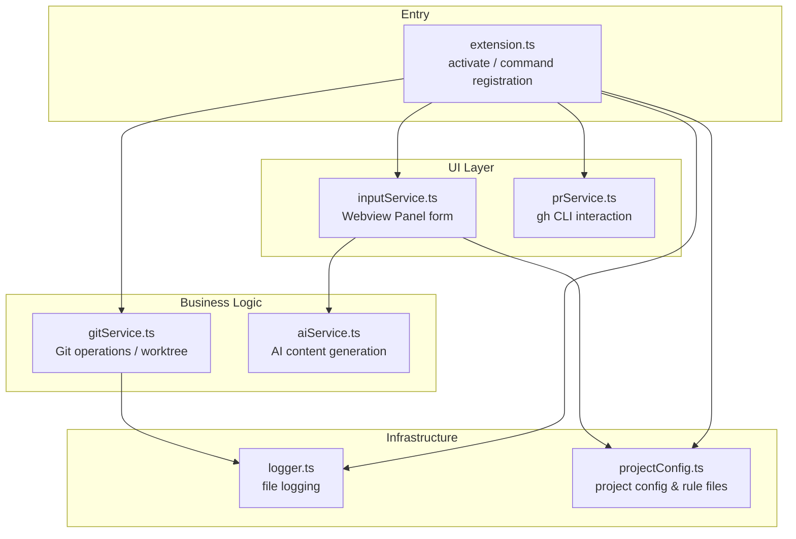

# Quick PR Studio Implementation Document

> Based on actual `src/` code — reflects real architecture and implementation details.

---

## 1. Architecture Overview

The extension consists of 6 core modules:



**Overall flow:**

```mermaid
flowchart LR
  A[User executes command<br/>quick-pr-studio.createPr] --> B[Initialize<br/>projectConfig + logger]
  B --> C[Check gh CLI<br/>installation + auth]
  C --> D[Get Git repo status<br/>current branch / changed files]
  D --> E[Open Webview panel<br/>file selection + form input + AI generation]
  E --> F[Create Worktree<br/>under .quick-pr-studio/worktrees/]
  F --> G[Copy selected files to worktree<br/>handle added/modified/deleted]
  G --> H[git add → git commit → git push<br/>with SSH/Proxy fallback]
  H --> I[gh pr create<br/>create GitHub PR]
  I --> J[Open PR link]
  J --> K[Clean up worktree<br/>automatic or prompt]
```



---

## 2. Module Details

### 2.1 [extension.ts](src/extension.ts) — Entry Point & Flow Orchestration

- Registers the `quick-pr-studio.createPr` command
- Initializes `projectConfig` and `logger` on activation
- Wraps the creation flow in `withProgress`, showing progress in the notification area

**Flow steps:**

1. Initialize `.quick-pr-studio` directory & logging
2. Check gh CLI (installation + auth)
3. Get current repo state (current branch, changed files list)
4. Collect user input (Webview form)
5. Create worktree → copy files → commit & push → create PR
6. Open PR URL
7. Clean up worktree (automatic or prompt, based on `cleanupWorktreeAfterPr` setting)

```ts
// Core call chain (simplified)
const ghAvailable = await checkGhCli();
const gitStatus = getCurrentRepo();
const changedFiles = getChangedFiles(gitStatus.repo);
const inputs = await collectInputs(workspaceRoot, changedFiles, gitStatus.currentBranch);
//               ↓
const wtPath = await createWorktree(repo, branchName);
await copyFilesToWorktree(originalRoot, wtPath, selectedFiles);
await commitAndPush(wtPath, commitMsg, branchName);
const url = await createPr({ title, body, base, head, worktreePath });
await openPrUrl(url);
await deleteWorktree(mainRepoPath, worktreePath);
```

### 2.2 [inputService.ts](src/inputService.ts) — Webview Input Panel

**Key difference from the original design:** Instead of using `showInputBox`/QuickPick multi-step input, it uses a **Webview Panel** hosting a full HTML form.

**Fields and features:**

- **File selection**: Lists all changed files (staged + working tree), with checkboxes to select files to include
- **Commit message** (required)
- **Branch name** (required, no spaces allowed)
- **PR Title** (required)
- **PR Body** (optional, textarea)
- **PR target branch** (required, defaults from projectConfig or current branch name)
- **✨ Generate with AI button**: Calls aiService to generate content, only fills empty fields without overwriting user input
- **⚙ Settings button**: Opens VS Code settings directly
- Instant form validation (red error messages)
- Enter key navigation between fields
- Submit button disabled on submission to prevent duplicates

**Message protocol (Webview ↔ Extension):**

| type | direction | description |
|------|-----------|-------------|
| `submit` | → extension | Submit form data |
| `cancel` | → extension | User cancelled |
| `generateAi` | → extension | Request AI generation |
| `openSettings` | → extension | Open settings page |
| `aiResult` | → webview | Return AI generation result |
| `aiComplete` | → webview | AI generation complete notification |

### 2.3 [gitService.ts](src/gitService.ts) — Git Operations Hub

#### Getting Repo & Changed Files

- Retrieves the `Repository` object via the VS Code built-in Git extension API
- `getCurrentRepo()` returns `GitStatus` (staged/working state, current branch name, repo object)
- `getChangedFiles()` merges `indexChanges` + `workingTreeChanges`, deduplicates, returns `{path, status}[]`

#### Creating a Worktree

- Worktree path: `<repo-root>/.quick-pr-studio/worktrees/<safe-branch-name>`
- Forward slashes in branch names are replaced with `-` (directory safety)
- First tries VS Code Git API `repo.createWorktree()`
- Falls back to native `git worktree add -b <branch> <path> <commitish>` on failure
- If the branch already exists, uses `git worktree add <path> <branch>` (without `-b`)
- Cleans up stale entries before creation: removes stale directories + `git worktree prune`

#### Copying Files to Worktree

- Iterates over selected files, computes relative paths mapped to the worktree
- File exists → `fs.copyFileSync` copies it
- File deleted → `fs.unlinkSync` removes it from the worktree
- Finally `git add -A` stages all changes

#### Commit & Push (with multi-level fallback)

- `git add -A` ensures all changes are staged
- Checks for actual changes (`git status --porcelain`)
- Commit message written to a temp file, then `git commit -F` (avoids shell escaping issues)
- **Push fallback chain:**
  1. `git push -u origin <branch>`
  2. On failure → SSH URL retry (automatically converts HTTPS remote to SSH)
  3. On further failure → HTTP Proxy retry (detects environment variables or git config)

#### Deleting a Worktree

- First attempts `git worktree remove --force`
- On failure, forces `fs.rmSync` + `git worktree prune`

#### Helper Functions

- `getFilesDiff()`: Gets the diff of selected files as AI context. Supports tracked files (`git diff HEAD`) and untracked files (builds a unified diff). Truncated to 8000 characters.
- `getRecentCommits()`: Gets the last 5 commit messages (for AI to reference commit style).
- `openPrUrl()`: Shows a success notification with an "Open in Browser" button.

### 2.4 [prService.ts](src/prService.ts) — GitHub CLI Interaction

**gh CLI check:**
1. `gh --version` detects whether gh is installed
2. `gh auth status` detects whether gh is authenticated (with hints about `GH_TOKEN`/`GITHUB_TOKEN` environment variables)

**Creating a PR:**
- Calls `gh pr create` with parameters: `--base`, `--head`, `--title`, `--body`
- Executes inside the worktree directory
- Returns the PR URL (the URL from stdout)

### 2.5 [aiService.ts](src/aiService.ts) — AI Content Generation

**Configuration (VS Code settings):**

| key | default | description |
|-----|---------|-------------|
| `quick-pr-studio.ai.enabled` | `false` | Enable toggle |
| `quick-pr-studio.ai.apiKey` | `""` | API key |
| `quick-pr-studio.ai.baseUrl` | `""` | Compatible endpoint (defaults to `https://api.openai.com/v1`) |
| `quick-pr-studio.ai.model` | `gpt-4o-mini` | Model name |
| `quick-pr-studio.ai.promptTemplate` | see package.json | System prompt |

**Generation logic:**

- Constructs a prompt containing: files diff + user's existing input + recent commits + project rules
- Calls an OpenAI-compatible API (`/chat/completions`)
- Expects JSON response: `{ commitMsg, branchName, title, body }`
- Only fills empty fields — never overwrites user-provided content
- Uses `response_format: { type: 'json_object' }` for structured output

### 2.6 [projectConfig.ts](src/projectConfig.ts) — Project Rule Configuration

Maintains project-level configuration inside `.quick-pr-studio/`:

```
.quick-pr-studio/
├── settings.json               # Main configuration
├── PR title rule.md            # PR title conventions
├── PR body rule.md             # PR body conventions
├── commit message rule.md      # Commit message conventions
├── branch name rule.md         # Branch naming conventions
├── .gitignore                  # Excludes everything from Git
└── log.log                     # Runtime log
```

**Default settings.json:**
```json
{
  "defaultBaseBranch": "main",
  "prTitleRulePath": ".quick-pr-studio/PR title rule.md",
  "prBodyRulePath": ".quick-pr-studio/PR body rule.md",
  "commitMessageRulePath": ".quick-pr-studio/commit message rule.md",
  "branchNameRulePath": ".quick-pr-studio/branch name rule.md"
}
```

### 2.7 [logger.ts](src/logger.ts) — Logging System

- Log file: `.quick-pr-studio/log.log`
- Levels: DEBUG / INFO / WARN / ERROR
- Format: `[timestamp] [LEVEL] [tag] message\n  contextKey: value\n  Stack: ...`
- ERROR level also outputs to `console.error`
- Automatically truncates context values exceeding 500 characters

---

## 3. VS Code Contribution Points

**Command:** `quick-pr-studio.createPr` — title: "Quick PR Studio: Create Pull Request"

**Settings (`package.json` contributes.configuration):**

| Setting | Type | Default | Description |
|---------|------|---------|-------------|
| `quick-pr-studio.ai.enabled` | boolean | false | Enable AI generation |
| `quick-pr-studio.ai.apiKey` | string | "" | API key |
| `quick-pr-studio.ai.baseUrl` | string | "" | API base URL |
| `quick-pr-studio.ai.model` | string | gpt-4o-mini | Model name |
| `quick-pr-studio.ai.promptTemplate` | string | ... | System prompt |
| `quick-pr-studio.cleanupWorktreeAfterPr` | boolean | true | Auto-cleanup worktree |

---

## 4. Design Decisions & Edge Cases

### Dependency Checks
- Not checked on activation; `checkGhCli()` runs at command execution time (dual validation: installation + auth)
- No gh → prompts with installation link
- Not authenticated → prompts `gh auth login` or setting `GH_TOKEN`

### Error Handling
- Each step has try/catch, errors displayed via `vscode.window.showErrorMessage`
- Logger records detailed context (including call stack, stderr)
- AI feature warns instead of errors when API key is missing

### File Selection Strategy
- Merges staged + working tree changes (doesn't require prior staging)
- Users freely select files via Webview checkboxes
- Only selected files are copied to the worktree

### Worktree Management
- Stored inside the repo at `.quick-pr-studio/worktrees/` (not a sibling directory)
- Automatically cleans up stale registrations
- Falls back to native git commands on creation failure

### Push Fault Tolerance
- HTTPS push failure automatically retries with SSH
- SSH failure automatically retries with HTTP Proxy
- Remote URL is updated on success

### AI Safety
- Only fills empty fields — never overwrites user input
- Close button / cancel does not freeze the UI
- When disabled, prompts "Open Settings" for quick navigation
