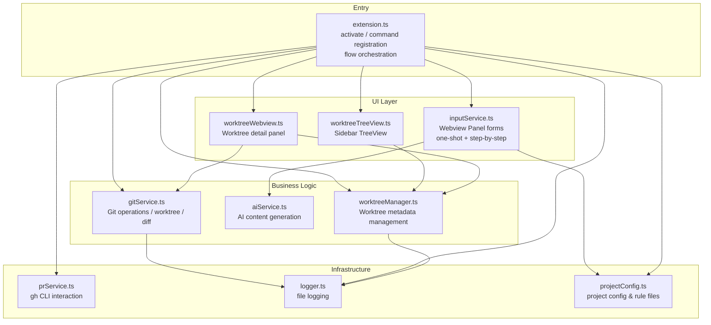

# Quick PR Studio Implementation Document

> Based on actual `src/` code — reflects real architecture and implementation details.

---

## 1. Architecture Overview

The extension consists of 9 core modules:



**Two workflow modes:**

```mermaid
flowchart TD
  subgraph "One-Shot Workflow (createPr)"
    O1[User executes command] --> O2[Initialize config + logger]
    O2 --> O3[Check gh CLI]
    O3 --> O4[Get repo status]
    O4 --> O5[Open Webview<br/>select files + fill form]
    O5 --> O6[Create Worktree]
    O6 --> O7[Copy files to worktree]
    O7 --> O8[commitOnly + pushWithFallbacks]
    O8 --> O9[gh pr create]
    O9 --> O10[Open PR link]
    O10 --> O11[Clean up worktree]
  end

  subgraph "Step-by-Step Workflow (startStepByStep)"
    S1[User executes command] --> S2[Initialize config + logger]
    S2 --> S3[Check gh CLI]
    S3 --> S4[Get repo status]
    S4 --> S5[Step form 1: Create Worktree<br/>branch name + target branch]
    S5 --> S6[Create Worktree<br/>register in worktreeManager]
    S6 --> S7[Step form 2: Add Commit<br/>select files + commit]
    S7 --> S8[commitOnly<br/>update metadata]
    S8 --> S9[More commits?]
    S9 -->|Yes| S7
    S9 -->|No| S10[Step form 3: Finalize PR<br/>PR title + body]
    S10 --> S11[pushWithFallbacks]
    S11 --> S12[gh pr create]
    S12 --> S13[Open PR link]
    S13 --> S14[Clean worktree + remove registration]
  end
```



---

## 2. Module Details

### 2.1 [extension.ts](src/extension.ts) — Entry Point & Flow Orchestration

- Registers all 8 commands
- Initializes projectConfig, logger, and TreeView on activation
- Two workflows: one-shot (`createPr`) and step-by-step (`startStepByStep` → `addCommit` → `finalizePr`)

**Registered commands:**

| Command | Description |
|---------|-------------|
| `quick-pr-studio.createPr` | One-shot PR creation (select files → fill → done) |
| `quick-pr-studio.startStepByStep` | Start step-by-step workflow (create worktree) |
| `quick-pr-studio.addCommit` | Add a commit to a worktree |
| `quick-pr-studio.finalizePr` | Final push and create PR |
| `quick-pr-studio.openWorktree` | Open worktree detail panel |
| `quick-pr-studio.retryWorktree` | Retry a failed worktree |
| `quick-pr-studio.cleanupWorktree` | Manually clean up a worktree |
| `quick-pr-studio.refreshWorktrees` | Refresh the sidebar tree |

**One-shot flow steps:**
1. Initialize `.quick-pr-studio` directory & logging
2. Check gh CLI (installation + auth)
3. Get current repo state (current branch, changed files list)
4. Collect user input (Webview form with side-by-side diff)
5. Create worktree → copy files → commitOnly + pushWithFallbacks → create PR
6. Open PR URL
7. Clean up worktree (automatic or prompt, based on setting)
8. Refresh sidebar

**Step-by-step flow steps:**
1. Check gh CLI + get repo status
2. Step form 1: fill branch name and target branch → create worktree → register in worktreeManager
3. Step form 2 (repeatable): select files, commit message → commitOnly → update metadata
4. Step form 3: PR title/body → pushWithFallbacks → create PR
5. Open PR URL → clean worktree → remove registration → refresh sidebar

```ts
// One-shot core call chain
const inputs = await collectInputs(wsRoot, changedFiles, currentBranch);
const wtPath = await createWorktree(repo, branchName);
await copyFilesToWorktree(originalRoot, wtPath, selectedFiles);
const committed = await commitOnly(wtPath, commitMsg);
const pushed = await pushWithFallbacks(wtPath, branchName);
const url = await createPr({ title, body, base, head, worktreePath });
```

```ts
// Step-by-step core call chain
// Step 1: startStepByStep
const { branchName, prBase } = await collectStepByStepInputs(wsRoot, currentBranch);
const wtPath = await createWorktree(repo, branchName);
addWorktree(wsRoot, { id, branchName, worktreePath, prBase, ... });

// Step 2: addCommit (repeatable)
const { selectedFiles, commitMsg } = await collectAddCommitInputs(wsRoot, worktree);
await copyFilesToWorktree(originalRoot, wtPath, selectedFiles);
await commitOnly(wtPath, commitMsg);
updateWorktree(wsRoot, id, { commitCount: n, lastCommitMsg, ... });

// Step 3: finalizePr
const { prTitle, prBody } = await collectFinalizePrInputs(wsRoot, worktree);
await pushWithFallbacks(wtPath, branchName);
const url = await createPr({ title, body, base, head, worktreePath });
```

#### TreeView Integration

Creates `WorktreeTreeDataProvider` and `TreeView` on activation, registered into VS Code's lifecycle. Calls `refresh()` after every worktree mutation (create, commit, finalize, delete).

### 2.2 [inputService.ts](src/inputService.ts) — Webview Input Panel

Uses a **Webview Panel** hosting a full HTML form. This commit adds step-by-step workflow forms and side-by-side diff views.

#### One-Shot Mode (`collectInputs`)

**Fields & features:**
- **File selection**: Lists all changed files (staged + working tree), with checkboxes
- **Commit message** (required)
- **Branch name** (required, no spaces)
- **PR Title** (required)
- **PR Body** (optional, textarea)
- **PR target branch** (required, defaults from projectConfig or current branch name)
- **Side-by-side diff view**: Double-click a file row to expand/collapse a side-by-side diff
- **✨ Generate with AI button**: Calls aiService, only fills empty fields
- **⚙ Settings button**: Opens VS Code settings directly
- Instant form validation (red error messages)
- Enter key navigation between fields
- Submit button disabled on submission

#### Step-by-Step Mode (3 separate forms)

| Function | Purpose | Fields |
|----------|---------|--------|
| `collectStepByStepInputs` | Create worktree | Branch name, PR target branch |
| `collectAddCommitInputs` | Add commit | File selection (with diff view), Commit message |
| `collectFinalizePrInputs` | Finalize PR | PR Title, PR Body |

**Message protocol (Webview ↔ Extension):**

| type | direction | description |
|------|-----------|-------------|
| `submit` | → extension | Submit form data |
| `cancel` | → extension | User cancelled |
| `generateAi` | → extension | Request AI generation |
| `openSettings` | → extension | Open settings page |
| `requestDiff` | → extension | Request file diff |
| `diffResult` | → webview | Return diff content (left/right columns) |
| `aiResult` | → webview | Return AI generation result |
| `aiComplete` | → webview | AI generation complete notification |

### 2.3 [gitService.ts](src/gitService.ts) — Git Operations Hub

#### Getting Repo & Changed Files

- Retrieves the `Repository` object via the VS Code built-in Git extension API
- `getCurrentRepo()` returns `GitStatus` (staged/working state, current branch name, repo object)
- `getChangedFiles()` merges `indexChanges` + `workingTreeChanges`, deduplicates, returns `{path, status}[]`

#### Creating a Worktree

- Worktree path: `<repo-root>/.quick-pr-studio/worktrees/<safe-branch-name>`
- Forward slashes in branch names replaced with `-` (directory safety)
- Tries VS Code Git API `repo.createWorktree()` first
- Falls back to native `git worktree add -b <branch> <path> <commitish>`
- If branch exists, uses `git worktree add <path> <branch>` (without `-b`)
- Cleans up stale entries before creation

#### Copying Files to Worktree

- Iterates over selected files, computes relative paths mapped to the worktree
- File exists → `fs.copyFileSync` copies it
- File deleted → `fs.unlinkSync` removes from worktree
- Finally `git add -A` stages all changes

#### Commit & Push (split into two operations)

**commitOnly:**
- `git add -A` ensures all changes are staged
- Checks for actual changes (`git status --porcelain`)
- Commit message via temp file, then `git commit -F` (avoids shell escaping)
- Returns boolean

**pushWithFallbacks:**
- **Push fallback chain:**
  1. `git push -u origin <branch>`
  2. On failure → SSH URL retry (converts HTTPS remote to SSH)
  3. On further failure → HTTP Proxy retry (env vars or git config)
- Returns boolean

#### Deleting a Worktree

- First `git worktree remove --force`
- On failure, forces `fs.rmSync` + `git worktree prune`

#### Branch Diff & File Diff

- `getBranchDiff()`: Gets diff summary between a worktree branch and its base branch
- `filterFilesCommittedToWorktree()`: Uses blob-hash comparison for accurate new/modified/deleted file detection against worktree branch (replaces the previous git-diff filtering approach)
- `getFileDiff()`: Gets raw unified diff for a single file (for side-by-side view), supports tracked (`git diff HEAD`) and untracked (constructs unified diff) files, truncated to 8000 chars
- `parseUnifiedDiff()`: Parses unified diff into structured `{leftLines, rightLines, lineNumbers}` arrays for side-by-side rendering
- `getDetailedFileStatus()`: Gets change status for a single file (added/modified/deleted)

#### Helper Functions

- `getRecentCommits()`: Gets last 5 commit messages (for AI reference)
- `openPrUrl()`: Shows a success notification with "Open in Browser" button

### 2.4 [prService.ts](src/prService.ts) — GitHub CLI Interaction

**gh CLI check:**
1. `gh --version` detects installation
2. `gh auth status` detects authentication (with hints about `GH_TOKEN`/`GITHUB_TOKEN`)

**Creating a PR:**
- Calls `gh pr create` with `--base`, `--head`, `--title`, `--body`
- Executes inside worktree directory
- Returns PR URL from stdout

### 2.5 [aiService.ts](src/aiService.ts) — AI Content Generation

**Configuration (VS Code settings):**

| key | default | description |
|-----|---------|-------------|
| `quick-pr-studio.ai.enabled` | `false` | Enable toggle |
| `quick-pr-studio.ai.apiKey` | `""` | API key |
| `quick-pr-studio.ai.baseUrl` | `""` | Compatible endpoint (defaults to `https://api.openai.com/v1`) |
| `quick-pr-studio.ai.model` | `gpt-4o-mini` | Model name |
| `quick-pr-studio.ai.promptTemplate` | see package.json | System prompt |

**Generation logic:**
- Constructs prompt: files diff + existing input + recent commits + project rules
- Calls OpenAI-compatible API (`/chat/completions`)
- Expects JSON response: `{ commitMsg, branchName, title, body }`
- Only fills empty fields — never overwrites user input
- Uses `response_format: { type: 'json_object' }` for structured output

### 2.6 [projectConfig.ts](src/projectConfig.ts) — Project Rule Configuration

Maintains project-level config inside `.quick-pr-studio/`:

```
.quick-pr-studio/
├── settings.json               # Main configuration
├── PR title rule.md            # PR title conventions
├── PR body rule.md             # PR body conventions
├── commit message rule.md      # Commit message conventions
├── branch name rule.md         # Branch naming conventions
├── .gitignore                  # Excludes everything from Git
├── worktrees.json              # Worktree registry (step-by-step mode)
└── log.log                     # Runtime log
```

**Default settings.json:**
```json
{
  "defaultBaseBranch": "main",
  "prTitleRulePath": ".quick-pr-studio/PR title rule.md",
  "prBodyRulePath": ".quick-pr-studio/PR body rule.md",
  "commitMessageRulePath": ".quick-pr-studio/commit message rule.md",
  "branchNameRulePath": ".quick-pr-studio/branch name rule.md"
}
```

### 2.7 [worktreeManager.ts](src/worktreeManager.ts) — Worktree Metadata Management

**Purpose:** Maintains a worktree registry in `.quick-pr-studio/worktrees.json`, tracking worktree state across VS Code sessions for the step-by-step workflow.

**Core API:**

| Function | Description |
|----------|-------------|
| `getAllWorktrees(root)` | Get all registered worktrees |
| `getWorktree(root, id)` | Get a single worktree by ID |
| `getActiveWorktree(root)` | Get the most recently active worktree |
| `addWorktree(root, info)` | Register a new worktree |
| `updateWorktree(root, id, updates)` | Update worktree metadata |
| `removeWorktree(root, id)` | Remove worktree registration |

**WorktreeInfo structure:**
```ts
interface WorktreeInfo {
  id: string;              // Safe branch name (/ → -)
  branchName: string;      // Actual branch name
  worktreePath: string;    // Worktree disk path
  baseCommitish: string;   // Base commit at creation
  prBase: string;          // PR target branch
  status: 'created' | 'committed' | 'pushed' | 'failed';
  commitCount: number;     // Number of commits made
  lastCommitMsg: string;   // Most recent commit message
  createdAt: string;       // ISO timestamp
  lastActivityAt: string;  // Last activity ISO timestamp
}
```

### 2.8 [worktreeTreeView.ts](src/worktreeTreeView.ts) — Sidebar TreeView

**Purpose:** VS Code `TreeDataProvider` that displays worktree management in the activity bar.

**View structure:**
- Top action: "Start Step-by-Step PR" (always visible)
- Each registered worktree as a collapsible group showing branch name + status
- Per-worktree action buttons:
  - **Open** → opens worktree detail panel
  - **Add Commit** → add commit to this worktree
  - **Finalize** → finalize PR (push + create)
  - **Delete** → remove worktree
- Context menu on right-click supports the same actions

**Refresh:** `refresh()` is called after every mutation (create, commit, finalize, delete).

### 2.9 [worktreeWebview.ts](src/worktreeWebview.ts) — Worktree Detail Panel

**Purpose:** Webview panel showing detailed information and operations for a single worktree.

**Contents:**
- **Info display:** branch name, status, commit count, last commit, target branch, creation time
- **File list:** filtered by `filterFilesCommittedToWorktree` to show only this worktree's changes, with status indicators (A/M/D)
- **Side-by-side diff view:** double-click a file row to expand diff
- **Action buttons:**
  - Add Commit → opens `collectAddCommitInputs`
  - Finalize PR → opens `collectFinalizePrInputs` then pushes and creates PR
  - Delete → removes worktree and cleans up

---

## 3. VS Code Contribution Points

### Commands

| Command ID | Title | Description |
|------------|-------|-------------|
| `quick-pr-studio.createPr` | Create Pull Request | One-shot PR creation |
| `quick-pr-studio.startStepByStep` | Start Step-by-Step PR | Begin step-by-step workflow |
| `quick-pr-studio.addCommit` | Add Commit to Active Worktree | Add a commit |
| `quick-pr-studio.finalizePr` | Finalize PR | Final push and create PR |
| `quick-pr-studio.openWorktree` | Open Worktree Details | View worktree details |
| `quick-pr-studio.retryWorktree` | Retry Failed Worktree | Retry failed worktree |
| `quick-pr-studio.cleanupWorktree` | Cleanup Worktree | Manual cleanup |
| `quick-pr-studio.refreshWorktrees` | Refresh Worktree List | Refresh sidebar |

### Views

| Container | View ID | Name |
|-----------|---------|------|
| `quick-pr-studio-worktrees` (activity bar) | `quick-pr-studio-worktreeList` | Worktrees |

Note: View container and view IDs only allow `[a-zA-Z0-9_-]` characters (no dots).

### Settings

| Setting | Type | Default | Description |
|---------|------|---------|-------------|
| `quick-pr-studio.ai.enabled` | boolean | false | Enable AI generation |
| `quick-pr-studio.ai.apiKey` | string | "" | API key |
| `quick-pr-studio.ai.baseUrl` | string | "" | API base URL |
| `quick-pr-studio.ai.model` | string | gpt-4o-mini | Model name |
| `quick-pr-studio.ai.promptTemplate` | string | ... | System prompt |
| `quick-pr-studio.cleanupWorktreeAfterPr` | boolean | true | Auto-cleanup worktree after PR (one-shot) |
| `quick-pr-studio.workflowMode` | enum | "one-shot" | Workflow mode: `one-shot` / `step-by-step` |
| `quick-pr-studio.autoCleanupWorktree` | boolean | false | Auto-cleanup after successful PR (step-by-step) |

---

## 4. Design Decisions & Edge Cases

### Dependency Checks
- Not checked on activation; `checkGhCli()` runs at command execution time
- No gh → prompts with installation link
- Not authenticated → prompts `gh auth login` or setting `GH_TOKEN`

### Error Handling
- Each step has try/catch, errors via `vscode.window.showErrorMessage`
- Logger records detailed context (call stack, stderr)
- AI feature warns instead of errors when API key is missing

### File Selection Strategy
- Merges staged + working tree changes (no prior staging required)
- Users freely select files via Webview checkboxes
- Only selected files are copied to the worktree

### Worktree Management
- Stored inside repo at `.quick-pr-studio/worktrees/` (not sibling directory)
- Auto-cleans stale registrations
- Falls back to native git commands on creation failure
- `worktreeManager` persists state in `worktrees.json` across sessions
- Blob-hash comparison accurately identifies files changed on worktree branch

### Push Fault Tolerance
- HTTPS push failure auto-retries with SSH
- SSH failure auto-retries with HTTP Proxy
- Remote URL updated on success

### AI Safety
- Only fills empty fields — never overwrites user input
- Close / cancel does not freeze UI
- When disabled, prompts "Open Settings" for quick navigation

### Step-by-Step Isolation
- Commit and push are separated, allowing multiple commit accumulation
- Forms pass state through `WorktreeInfo` metadata between steps
- Sidebar reflects worktree status in real time
