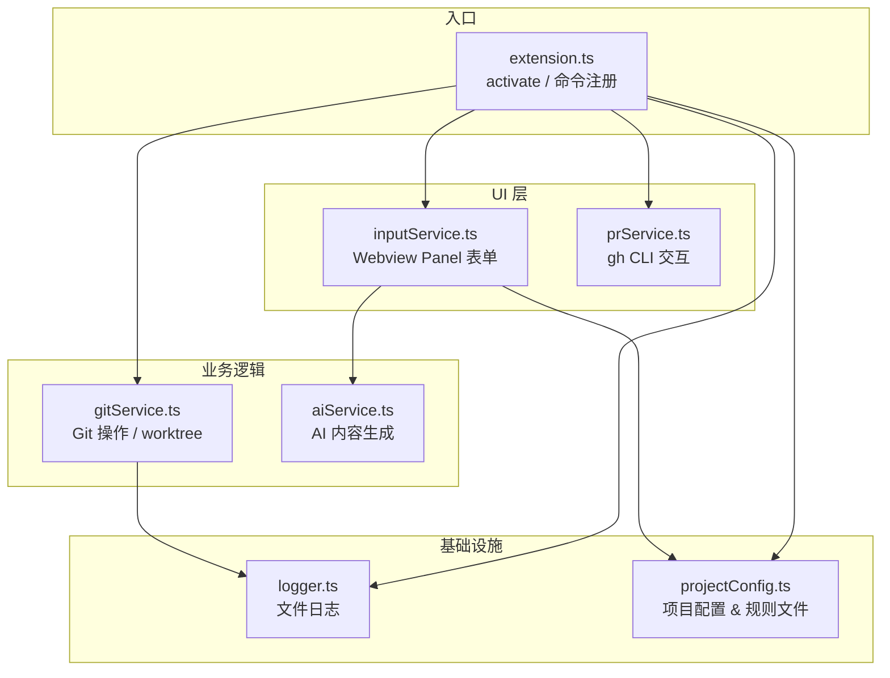

# Quick PR Studio 实现文档

> 基于 `src/` 实际代码更新，反映真实架构与实现细节。

---

## 一、架构总览

扩展由 6 个核心模块组成，各司其职：



**整体流程：**

```mermaid
flowchart LR
  A[用户执行命令<br/>quick-pr-studio.createPr] --> B[初始化<br/>projectConfig + logger]
  B --> C[检查 gh CLI<br/>安装 + 认证]
  C --> D[获取 Git 仓库状态<br/>当前分支 / 更改文件]
  D --> E[打开 Webview 面板<br/>文件选择 + 表单输入 + AI 生成]
  E --> F[创建 Worktree<br/>.quick-pr-studio/worktrees/ 下]
  F --> G[复制选中文件到 worktree<br/>处理新增/修改/删除]
  G --> H[git add → git commit → git push<br/>带 SSH/Proxy 回退]
  H --> I[gh pr create<br/>创建 GitHub PR]
  I --> J[打开 PR 链接]
  J --> K[清理 worktree<br/>自动或询问]
```



---

## 二、模块详解

### 1. [extension.ts](src/extension.ts) — 入口与流程编排

- 注册命令 `quick-pr-studio.createPr`
- 激活时初始化 projectConfig 和 logger
- 以 `withProgress` 包装创建流程，在通知区域显示进度

**流程步骤：**

1. 初始化 `.quick-pr-studio` 目录 & 日志
2. 检查 gh CLI（安装 + 认证）
3. 获取当前仓库状态（当前分支、更改文件列表）
4. 收集用户输入（Webview 表单）
5. 创建 worktree → 复制文件 → commit & push → 创建 PR
6. 打开 PR URL
7. 清理 worktree（按设置 `cleanupWorktreeAfterPr` 自动或询问）

```ts
// 核心调用链（简化）
const ghAvailable = await checkGhCli();
const gitStatus = getCurrentRepo();
const changedFiles = getChangedFiles(gitStatus.repo);
const inputs = await collectInputs(workspaceRoot, changedFiles, gitStatus.currentBranch);
//               ↓
const wtPath = await createWorktree(repo, branchName);
await copyFilesToWorktree(originalRoot, wtPath, selectedFiles);
await commitAndPush(wtPath, commitMsg, branchName);
const url = await createPr({ title, body, base, head, worktreePath });
await openPrUrl(url);
await deleteWorktree(mainRepoPath, worktreePath);
```

### 2. [inputService.ts](src/inputService.ts) — Webview 输入面板

**与原始设计的关键差异：** 未使用 `showInputBox`/QuickPick 多步输入，而是采用 **Webview Panel** 承载完整 HTML 表单。

**包含的字段与功能：**

- **文件选择**：列出所有更改文件（暂存 + 工作区），复选框选择要包含的文件
- **Commit message**（必填）
- **Branch name**（必填，不允许空格）
- **PR Title**（必填）
- **PR Body**（可选，textarea）
- **PR target branch**（必填，默认来自 projectConfig 或当前分支同名）
- **✨ Generate with AI 按钮**：调用 aiService 生成内容，只填充空字段不覆盖用户输入
- **⚙ Settings 按钮**：直接打开 VS Code 设置
- 即时表单验证（红色错误提示）
- Enter 键在字段间跳转
- 提交后禁用按钮防重复

**消息协议（Webview ↔ Extension）：**

| type | 方向 | 说明 |
|------|------|------|
| `submit` | extension | 提交表单数据 |
| `cancel` | extension | 用户取消 |
| `generateAi` | extension | 请求 AI 生成 |
| `openSettings` | extension | 打开设置页 |
| `aiResult` | webview | 返回 AI 生成结果 |
| `aiComplete` | webview | AI 生成完成通知 |

### 3. [gitService.ts](src/gitService.ts) — Git 操作中心

#### 获取仓库与更改文件

- 通过 VS Code 内置 Git 扩展 API 获取 `Repository` 对象
- `getCurrentRepo()` 返回 `GitStatus`（staged/working 状态、当前分支名、repo 对象）
- `getChangedFiles()` 合并 `indexChanges` + `workingTreeChanges`，去重后返回 `{path, status}[]`

#### 创建 Worktree

- worktree 路径：`<repo-root>/.quick-pr-studio/worktrees/<safe-branch-name>`
- 分支名中的 `/` 替换为 `-`（目录安全）
- 先尝试 VS Code Git API `repo.createWorktree()`
- 失败后回退到原生 `git worktree add -b <branch> <path> <commitish>`
- 若分支已存在，用 `git worktree add <path> <branch>`（不带 `-b`）
- 创建前清理残留：删除 stale 目录 + `git worktree prune`

#### 复制文件到 Worktree

- 遍历选中文件，计算相对路径映射到 worktree
- 文件存在 → `fs.copyFileSync` 复制
- 文件已删除 → `fs.unlinkSync` 从 worktree 移除
- 最后 `git add -A` 暂存所有变更

#### Commit & Push（带多级回退）

- `git add -A` 确保所有变更被暂存
- 检查是否有实际变更（`git status --porcelain`）
- 提交信息写入临时文件后 `git commit -F`（避免 shell 转义问题）
- **Push 回退链：**
  1. `git push -u origin <branch>`
  2. 失败 → SSH URL 重试（自动将 HTTPS remote 转换为 SSH）
  3. 再失败 → HTTP Proxy 重试（检测环境变量或 git config）

#### 删除 Worktree

- 先 `git worktree remove --force`
- 失败则强制 `fs.rmSync` + `git worktree prune`

#### 辅助功能

- `getFilesDiff()`：获取选中文件的 diff（作为 AI 上下文），支持 tracked（`git diff HEAD`）和 untracked（构造 unified diff）文件，截断至 8000 字符
- `getRecentCommits()`：获取最近 5 条提交记录（供 AI 参考 commit 风格）
- `openPrUrl()`：通知栏显示成功消息，提供"Open in Browser"按钮

### 4. [prService.ts](src/prService.ts) — GitHub CLI 交互

**gh CLI 检查：**
1. `gh --version` 检测是否安装
2. `gh auth status` 检测是否认证（含 GH_TOKEN/GITHUB_TOKEN 环境变量提示）

**创建 PR：**
- 调用 `gh pr create` 参数：`--base`, `--head`, `--title`, `--body`
- 在 worktree 目录下执行
- 返回 PR URL（stdout 中的 URL）

### 5. [aiService.ts](src/aiService.ts) — AI 内容生成

**配置（VS Code settings）：**

| key | 默认值 | 说明 |
|-----|--------|------|
| `quick-pr-studio.ai.enabled` | `false` | 启用开关 |
| `quick-pr-studio.ai.apiKey` | `""` | API key |
| `quick-pr-studio.ai.baseUrl` | `""` | 兼容端点（默认 `https://api.openai.com/v1`） |
| `quick-pr-studio.ai.model` | `gpt-4o-mini` | 模型名 |
| `quick-pr-studio.ai.promptTemplate` | 见 package.json | System prompt |

**生成逻辑：**

- 构造 prompt 包含：files diff + 用户已有输入 + 最近 commits + 项目规则
- 调用 OpenAI-compatible API（`/chat/completions`）
- 要求返回 JSON：`{ commitMsg, branchName, title, body }`
- 只填充空字段，不覆盖用户已填内容
- 响应格式使用 `response_format: { type: 'json_object' }`

### 6. [projectConfig.ts](src/projectConfig.ts) — 项目规则配置

在 `.quick-pr-studio/` 目录下维护项目级配置：

```
.quick-pr-studio/
├── settings.json               # 主配置
├── PR title rule.md            # PR 标题规范
├── PR body rule.md             # PR 正文规范
├── commit message rule.md      # 提交信息规范
├── branch name rule.md         # 分支命名规范
├── .gitignore                  # 所有内容排除 Git
└── log.log                     # 运行日志
```

**settings.json 默认值：**
```json
{
  "defaultBaseBranch": "main",
  "prTitleRulePath": ".quick-pr-studio/PR title rule.md",
  "prBodyRulePath": ".quick-pr-studio/PR body rule.md",
  "commitMessageRulePath": ".quick-pr-studio/commit message rule.md",
  "branchNameRulePath": ".quick-pr-studio/branch name rule.md"
}
```

### 7. [logger.ts](src/logger.ts) — 日志系统

- 日志文件：`.quick-pr-studio/log.log`
- 级别：DEBUG / INFO / WARN / ERROR
- 格式：`[timestamp] [LEVEL] [tag] message\n  contextKey: value\n  Stack: ...`
- ERROR 级别同时输出到 `console.error`
- 自动截断超过 500 字符的 context 值

---

## 三、VS Code 贡献点

**命令：** `quick-pr-studio.createPr` — 标题 "Quick PR Studio: Create Pull Request"

**设置（`package.json` contributes.configuration）：**

| 设置 | 类型 | 默认 | 说明 |
|------|------|------|------|
| `quick-pr-studio.ai.enabled` | boolean | false | 启用 AI 生成 |
| `quick-pr-studio.ai.apiKey` | string | "" | API key |
| `quick-pr-studio.ai.baseUrl` | string | "" | API 基础 URL |
| `quick-pr-studio.ai.model` | string | gpt-4o-mini | 模型名 |
| `quick-pr-studio.ai.promptTemplate` | string | ... | System prompt |
| `quick-pr-studio.cleanupWorktreeAfterPr` | boolean | true | 自动清理 worktree |

---

## 四、设计要点与边界情况

### 依赖检查
- 激活时不检查，命令执行时先 `checkGhCli()`（安装 + 认证双重校验）
- 无 gh → 提示安装链接
- 未认证 → 提示 `gh auth login` 或设置 GH_TOKEN

### 错误处理
- 每个步骤有 try/catch，通过 `vscode.window.showErrorMessage` 展示
- logger 记录详细 context（含调用栈、stderr）
- AI 功能无 API key 时显示警告而非错误

### 文件选择策略
- 合并暂存 + 工作区更改（不要求必须先 stage）
- 用户通过 Webview 复选框自由选择
- 只复制勾选的文件到 worktree

### Worktree 管理
- 存放在仓库内 `.quick-pr-studio/worktrees/`（非同级目录）
- 自动清理 stale registrations
- 创建失败时自动回退到原生 git 命令

### Push 容错
- HTTPS push 失败自动尝试 SSH
- SSH 失败自动尝试 HTTP Proxy
- 成功后更新 remote URL

### AI 安全
- 只填充空字段，不覆盖用户输入
- 关闭按钮 / 取消不卡死
- 未启用时提示"Open Settings"快速跳转
