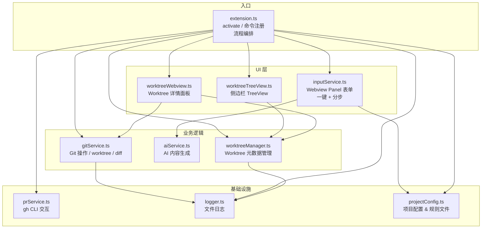

# Quick PR Studio 实现文档

> 基于 `src/` 实际代码更新，反映真实架构与实现细节。

---

## 一、架构总览

扩展由 9 个核心模块组成，各司其职：



**两种工作流：**

```mermaid
flowchart TD
  subgraph "一键工作流 (createPr)"
    O1[用户执行命令] --> O2[初始化 config + logger]
    O2 --> O3[检查 gh CLI]
    O3 --> O4[获取仓库状态]
    O4 --> O5[打开 Webview<br/>选择文件 + 填写表单]
    O5 --> O6[创建 Worktree]
    O6 --> O7[复制文件到 worktree]
    O7 --> O8[commitOnly + pushWithFallbacks]
    O8 --> O9[gh pr create]
    O9 --> O10[打开 PR 链接]
    O10 --> O11[清理 worktree]
  end

  subgraph "分步工作流 (startStepByStep)"
    S1[用户执行命令] --> S2[初始化 config + logger]
    S2 --> S3[检查 gh CLI]
    S3 --> S4[获取仓库状态]
    S4 --> S5[分步表单 1: 创建 worktree<br/>分支名 + 目标分支]
    S5 --> S6[创建 Worktree<br/>注册到 worktreeManager]
    S6 --> S7[分步表单 2: Add Commit<br/>选择文件 + commit]
    S7 --> S8[commitOnly<br/>更新元数据]
    S8 --> S9[更多 commit？]
    S9 -->|是| S7
    S9 -->|否| S10[分步表单 3: Finalize PR<br/>PR 标题 + 内容]
    S10 --> S11[pushWithFallbacks]
    S11 --> S12[gh pr create]
    S12 --> S13[打开 PR 链接]
    S13 --> S14[清理 worktree + 移除注册]
  end
```



---

## 二、模块详解

### 1. [extension.ts](src/extension.ts) — 入口与流程编排

- 注册所有命令（8 个）
- 初始化 projectConfig、logger 和树视图
- 两种工作流：一键模式（`createPr`）和分步模式（`startStepByStep` → `addCommit` → `finalizePr`）

**注册命令：**

| 命令 | 说明 |
|------|------|
| `quick-pr-studio.createPr` | 一键创建 PR（选择文件 → 填写 → 完成） |
| `quick-pr-studio.startStepByStep` | 开始分步工作流（创建 worktree） |
| `quick-pr-studio.addCommit` | 向 worktree 添加提交 |
| `quick-pr-studio.finalizePr` | 最终提交并创建 PR |
| `quick-pr-studio.openWorktree` | 打开 worktree 详情面板 |
| `quick-pr-studio.retryWorktree` | 重试失败的 worktree |
| `quick-pr-studio.cleanupWorktree` | 手动清理 worktree |
| `quick-pr-studio.refreshWorktrees` | 刷新侧边栏列表 |

**一键流程步骤：**
1. 初始化 `.quick-pr-studio` 目录 & 日志
2. 检查 gh CLI（安装 + 认证）
3. 获取当前仓库状态（当前分支、更改文件列表）
4. 收集用户输入（Webview 表单，含侧边对比 diff）
5. 创建 worktree → 复制文件 → commitOnly + pushWithFallbacks → 创建 PR
6. 打开 PR URL
7. 清理 worktree（按设置自动或询问）
8. 刷新侧边栏

**分步流程步骤：**
1. 检查 gh CLI + 获取仓库状态
2. 分步表单 1：填写分支名和目标分支 → 创建 worktree → 注册到 worktreeManager
3. 分步表单 2（可重复）：选择文件、填写 commit 信息 → commitOnly → 更新元数据
4. 分步表单 3：填写 PR 标题/正文 → pushWithFallbacks → 创建 PR
5. 打开 PR URL → 清理 worktree → 移除注册 → 刷新侧边栏

```ts
// 一键流程核心调用链
const inputs = await collectInputs(wsRoot, changedFiles, currentBranch);
const wtPath = await createWorktree(repo, branchName);
await copyFilesToWorktree(originalRoot, wtPath, selectedFiles);
const committed = await commitOnly(wtPath, commitMsg);
const pushed = await pushWithFallbacks(wtPath, branchName);
const url = await createPr({ title, body, base, head, worktreePath });
```

```ts
// 分步流程核心调用链
// Step 1: startStepByStep
const { branchName, prBase } = await collectStepByStepInputs(wsRoot, currentBranch);
const wtPath = await createWorktree(repo, branchName);
addWorktree(wsRoot, { id, branchName, worktreePath, prBase, ... });

// Step 2: addCommit（可多次）
const { selectedFiles, commitMsg } = await collectAddCommitInputs(wsRoot, worktree);
await copyFilesToWorktree(originalRoot, wtPath, selectedFiles);
await commitOnly(wtPath, commitMsg);
updateWorktree(wsRoot, id, { commitCount: n, lastCommitMsg, ... });

// Step 3: finalizePr
const { prTitle, prBody } = await collectFinalizePrInputs(wsRoot, worktree);
await pushWithFallbacks(wtPath, branchName);
const url = await createPr({ title, body, base, head, worktreePath });
```

#### 树视图集成

激活时创建 `WorktreeTreeDataProvider` 和 `TreeView`，将其注册到 VS Code 生命周期中。每次 worktree 变更后（创建、提交、完成、删除）调用 `refresh()` 更新侧边栏。

### 2. [inputService.ts](src/inputService.ts) — Webview 输入面板

采用 **Webview Panel** 承载完整 HTML 表单。本 commit 新增分步工作流表单和侧边对比 diff 视图。

#### 一键模式 (`collectInputs`)

**字段与功能：**
- **文件选择**：列出所有更改文件（暂存 + 工作区），复选框选择
- **Commit message**（必填）
- **Branch name**（必填，不允许空格）
- **PR Title**（必填）
- **PR Body**（可选，textarea）
- **PR target branch**（必填，默认来自 projectConfig 或当前分支同名）
- **侧边对比 diff 视图**：双击文件行展开/收起 side-by-side diff
- **✨ Generate with AI 按钮**：调用 aiService 生成内容，只填充空字段不覆盖用户输入
- **⚙ Settings 按钮**：直接打开 VS Code 设置
- 即时表单验证（红色错误提示）
- Enter 键在字段间跳转
- 提交后禁用按钮防重复

#### 分步模式 (3 个独立表单)

| 函数 | 用途 | 字段 |
|------|------|------|
| `collectStepByStepInputs` | 创建 worktree | Branch name、PR target branch |
| `collectAddCommitInputs` | 添加提交 | 文件选择（含 diff 视图）、Commit message |
| `collectFinalizePrInputs` | 完成 PR | PR Title、PR Body |

**消息协议（Webview ↔ Extension）：**

| type | 方向 | 说明 |
|------|------|------|
| `submit` | → extension | 提交表单数据 |
| `cancel` | → extension | 用户取消 |
| `generateAi` | → extension | 请求 AI 生成 |
| `openSettings` | → extension | 打开设置页 |
| `requestDiff` | → extension | 请求文件 diff |
| `diffResult` | → webview | 返回 diff 内容（分左右两栏） |
| `aiResult` | → webview | 返回 AI 生成结果 |
| `aiComplete` | → webview | AI 生成完成通知 |

### 3. [gitService.ts](src/gitService.ts) — Git 操作中心

#### 获取仓库与更改文件

- 通过 VS Code 内置 Git 扩展 API 获取 `Repository` 对象
- `getCurrentRepo()` 返回 `GitStatus`（staged/working 状态、当前分支名、repo 对象）
- `getChangedFiles()` 合并 `indexChanges` + `workingTreeChanges`，去重后返回 `{path, status}[]`

#### 创建 Worktree

- worktree 路径：`<repo-root>/.quick-pr-studio/worktrees/<safe-branch-name>`
- 分支名中的 `/` 替换为 `-`（目录安全）
- 先尝试 VS Code Git API `repo.createWorktree()`
- 失败后回退到原生 `git worktree add -b <branch> <path> <commitish>`
- 若分支已存在，用 `git worktree add <path> <branch>`（不带 `-b`）
- 创建前清理残留：删除 stale 目录 + `git worktree prune`

#### 复制文件到 Worktree

- 遍历选中文件，计算相对路径映射到 worktree
- 文件存在 → `fs.copyFileSync` 复制
- 文件已删除 → `fs.unlinkSync` 从 worktree 移除
- 最后 `git add -A` 暂存所有变更

#### Commit & Push（分离为两步）

**commitOnly：**
- `git add -A` 确保所有变更被暂存
- 检查是否有实际变更（`git status --porcelain`）
- commit 信息写入临时文件后 `git commit -F`（避免 shell 转义问题）
- 返回 boolean 表示成功与否

**pushWithFallbacks：**
- **Push 回退链：**
  1. `git push -u origin <branch>`
  2. 失败 → SSH URL 重试（自动将 HTTPS remote 转换为 SSH）
  3. 再失败 → HTTP Proxy 重试（检测环境变量或 git config）
- 返回 boolean 表示成功与否

#### 删除 Worktree

- 先 `git worktree remove --force`
- 失败则强制 `fs.rmSync` + `git worktree prune`

#### 分支 Diff 与文件 Diff

- `getBranchDiff()`：获取 worktree 分支与 base 分支之间的 diff 摘要
- `filterFilesCommittedToWorktree()`：通过 blob-hash 对比精确检测 worktree 分支上的新增/修改/删除文件，替代之前的 git-diff 过滤方式
- `getFileDiff()`：获取单个文件的原始 unified diff（用于 side-by-side 视图），支持 tracked（`git diff HEAD`）和 untracked（构造 unified diff）文件，截断至 8000 字符
- `parseUnifiedDiff()`：解析 unified diff 为结构化的 `{leftLines, rightLines, lineNumbers}` 数组，供 side-by-side 渲染
- `getDetailedFileStatus()`：获取单文件的变更状态（新增/修改/删除）

#### 辅助功能

- `getRecentCommits()`：获取最近 5 条提交记录（供 AI 参考 commit 风格）
- `openPrUrl()`：通知栏显示成功消息，提供"Open in Browser"按钮

### 4. [prService.ts](src/prService.ts) — GitHub CLI 交互

**gh CLI 检查：**
1. `gh --version` 检测是否安装
2. `gh auth status` 检测是否认证（含 GH_TOKEN/GITHUB_TOKEN 环境变量提示）

**创建 PR：**
- 调用 `gh pr create` 参数：`--base`, `--head`, `--title`, `--body`
- 在 worktree 目录下执行
- 返回 PR URL（stdout 中的 URL）

### 5. [aiService.ts](src/aiService.ts) — AI 内容生成

**配置（VS Code settings）：**

| key | 默认值 | 说明 |
|-----|--------|------|
| `quick-pr-studio.ai.enabled` | `false` | 启用开关 |
| `quick-pr-studio.ai.apiKey` | `""` | API key |
| `quick-pr-studio.ai.baseUrl` | `""` | 兼容端点（默认 `https://api.openai.com/v1`） |
| `quick-pr-studio.ai.model` | `gpt-4o-mini` | 模型名 |
| `quick-pr-studio.ai.promptTemplate` | 见 package.json | System prompt |

**生成逻辑：**

- 构造 prompt 包含：files diff + 用户已有输入 + 最近 commits + 项目规则
- 调用 OpenAI-compatible API（`/chat/completions`）
- 要求返回 JSON：`{ commitMsg, branchName, title, body }`
- 只填充空字段，不覆盖用户已填内容
- 响应格式使用 `response_format: { type: 'json_object' }`

### 6. [projectConfig.ts](src/projectConfig.ts) — 项目规则配置

在 `.quick-pr-studio/` 目录下维护项目级配置：

```
.quick-pr-studio/
├── settings.json               # 主配置
├── PR title rule.md            # PR 标题规范
├── PR body rule.md             # PR 正文规范
├── commit message rule.md      # 提交信息规范
├── branch name rule.md         # 分支命名规范
├── .gitignore                  # 所有内容排除 Git
├── worktrees.json              # Worktree 注册表（分步模式）
└── log.log                     # 运行日志
```

**settings.json 默认值：**
```json
{
  "defaultBaseBranch": "main",
  "prTitleRulePath": ".quick-pr-studio/PR title rule.md",
  "prBodyRulePath": ".quick-pr-studio/PR body rule.md",
  "commitMessageRulePath": ".quick-pr-studio/commit message rule.md",
  "branchNameRulePath": ".quick-pr-studio/branch name rule.md"
}
```

### 7. [worktreeManager.ts](src/worktreeManager.ts) — Worktree 元数据管理

**功能：** 在 `.quick-pr-studio/worktrees.json` 中维护 worktree 注册表，支持分步工作流中跨 VS Code 会话追踪 worktree 状态。

**核心接口：**

| 函数 | 说明 |
|------|------|
| `getAllWorktrees(root)` | 获取所有已注册 worktree |
| `getWorktree(root, id)` | 按 ID 获取单个 worktree |
| `getActiveWorktree(root)` | 获取最近活跃的 worktree |
| `addWorktree(root, info)` | 注册新 worktree |
| `updateWorktree(root, id, updates)` | 更新 worktree 元数据 |
| `removeWorktree(root, id)` | 移除 worktree 注册 |

**WorktreeInfo 结构：**
```ts
interface WorktreeInfo {
  id: string;              // 安全分支名（/ → -）
  branchName: string;      // 实际分支名
  worktreePath: string;    // worktree 磁盘路径
  baseCommitish: string;   // 创建时的 base commit
  prBase: string;          // PR 目标分支
  status: 'created' | 'committed' | 'pushed' | 'failed';
  commitCount: number;     // 已提交次数
  lastCommitMsg: string;   // 最近一次 commit 信息
  createdAt: string;       // ISO 时间戳
  lastActivityAt: string;  // 最近活动时间戳
}
```

### 8. [worktreeTreeView.ts](src/worktreeTreeView.ts) — 侧边栏 TreeView

**功能：** VS Code `TreeDataProvider`，在活动栏显示 worktree 列表。

**视图结构：**
- 顶部按钮："Start Step-by-Step PR"（始终显示）
- 每个已注册 worktree 为一个可折叠分组，显示分支名和状态
- 每个 worktree 下的操作按钮：
  - **Open** → 打开 worktree 详情面板
  - **Add Commit** → 向该 worktree 添加提交
  - **Finalize** → 完成 PR（推送到远程）
  - **Delete** → 删除 worktree
- 右键菜单支持相同操作

**刷新机制：** 所有 worktree 变更操作（创建、提交、完成、删除）后调用 `refresh()`。

### 9. [worktreeWebview.ts](src/worktreeWebview.ts) — Worktree 详情面板

**功能：** Webview 面板展示单个 worktree 的详细信息与操作入口。

**包含内容：**
- **信息展示：** 分支名、状态、commit 计数、最近 commit、目标分支、创建时间
- **文件列表：** 通过 `filterFilesCommittedToWorktree` 过滤只显示当前 worktree 的变更文件，每行显示状态（A/M/D）
- **侧边对比 diff 视图：** 双击文件行展开 side-by-side diff
- **操作按钮：**
  - Add Commit → 打开 `collectAddCommitInputs`
  - Finalize PR → 打开 `collectFinalizePrInputs` 后推送并创建 PR
  - Delete → 删除 worktree 并清理

---

## 三、VS Code 贡献点

### 命令

| 命令 ID | 标题 | 说明 |
|---------|------|------|
| `quick-pr-studio.createPr` | Create Pull Request | 一键创建 PR |
| `quick-pr-studio.startStepByStep` | Start Step-by-Step PR | 开始分步工作流 |
| `quick-pr-studio.addCommit` | Add Commit to Active Worktree | 添加提交 |
| `quick-pr-studio.finalizePr` | Finalize PR | 最终提交并创建 PR |
| `quick-pr-studio.openWorktree` | Open Worktree Details | 查看 worktree 详情 |
| `quick-pr-studio.retryWorktree` | Retry Failed Worktree | 重试失败 worktree |
| `quick-pr-studio.cleanupWorktree` | Cleanup Worktree | 手动清理 |
| `quick-pr-studio.refreshWorktrees` | Refresh Worktree List | 刷新侧边栏 |

### 视图

| 容器 | 视图 ID | 名称 |
|------|---------|------|
| `quick-pr-studio-worktrees`（活动栏） | `quick-pr-studio-worktreeList` | Worktrees |

注意：视图容器和视图 ID 仅允许 `[a-zA-Z0-9_-]` 字符，不允许使用点号。

### 设置

| 设置 | 类型 | 默认 | 说明 |
|------|------|------|------|
| `quick-pr-studio.ai.enabled` | boolean | false | 启用 AI 生成 |
| `quick-pr-studio.ai.apiKey` | string | "" | API key |
| `quick-pr-studio.ai.baseUrl` | string | "" | API 基础 URL |
| `quick-pr-studio.ai.model` | string | gpt-4o-mini | 模型名 |
| `quick-pr-studio.ai.promptTemplate` | string | ... | System prompt |
| `quick-pr-studio.cleanupWorktreeAfterPr` | boolean | true | 一键模式下 PR 完成后自动清理 |
| `quick-pr-studio.workflowMode` | enum | "one-shot" | 工作流模式：`one-shot` / `step-by-step` |
| `quick-pr-studio.autoCleanupWorktree` | boolean | false | 分步模式下 PR 成功后自动清理 |

---

## 四、设计要点与边界情况

### 依赖检查
- 激活时不检查，命令执行时先 `checkGhCli()`（安装 + 认证双重校验）
- 无 gh → 提示安装链接
- 未认证 → 提示 `gh auth login` 或设置 GH_TOKEN

### 错误处理
- 每个步骤有 try/catch，通过 `vscode.window.showErrorMessage` 展示
- logger 记录详细 context（含调用栈、stderr）
- AI 功能无 API key 时显示警告而非错误

### 文件选择策略
- 合并暂存 + 工作区更改（不要求必须先 stage）
- 用户通过 Webview 复选框自由选择
- 只复制勾选的文件到 worktree

### Worktree 管理
- 存放在仓库内 `.quick-pr-studio/worktrees/`（非同级目录）
- 自动清理 stale registrations
- 创建失败时自动回退到原生 git 命令
- `worktreeManager` 通过 `worktrees.json` 注册表跨会话追踪
- blob-hash 对比精确识别 worktree 分支上的变更文件

### Push 容错
- HTTPS push 失败自动尝试 SSH
- SSH 失败自动尝试 HTTP Proxy
- 成功后更新 remote URL

### AI 安全
- 只填充空字段，不覆盖用户输入
- 关闭按钮 / 取消不卡死
- 未启用时提示"Open Settings"快速跳转

### 分步工作流隔离
- commit 和 push 分离，允许多次 commit 累积
- 分步表单之间通过 `WorktreeInfo` 元数据传递状态
- 侧边栏实时反映 worktree 状态变化
